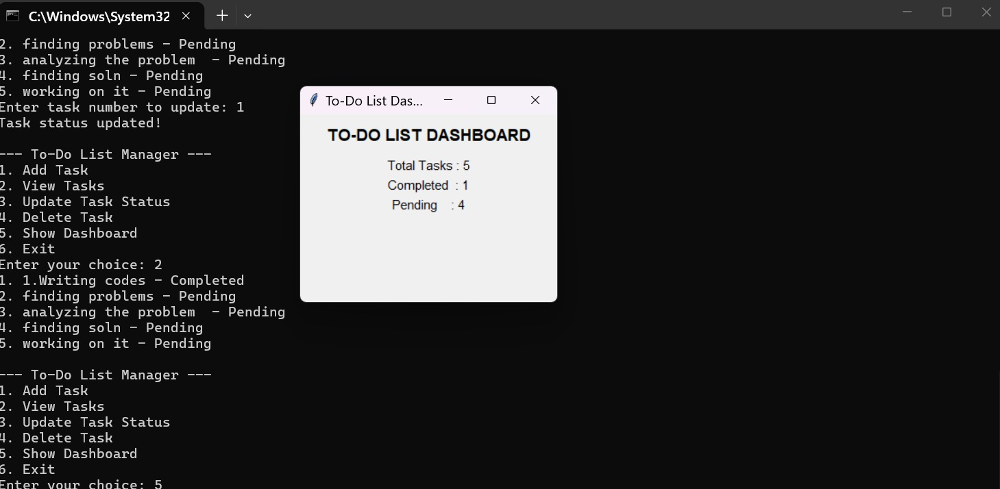

To-Do List Manager

Problem Statement
Create a To-Do List Manager that allows users to add tasks, view tasks, update task status, and delete tasks using a command-line interface.

Features
- Add new tasks
- View all tasks
- Update task status (Completed / Pending)
- Delete tasks
- File-based storage

Technologies Used
- Python

  

Steps to Run
1. Clone the repository
2. Navigate to the project directory
3. Run the program using:
   python todo.py

