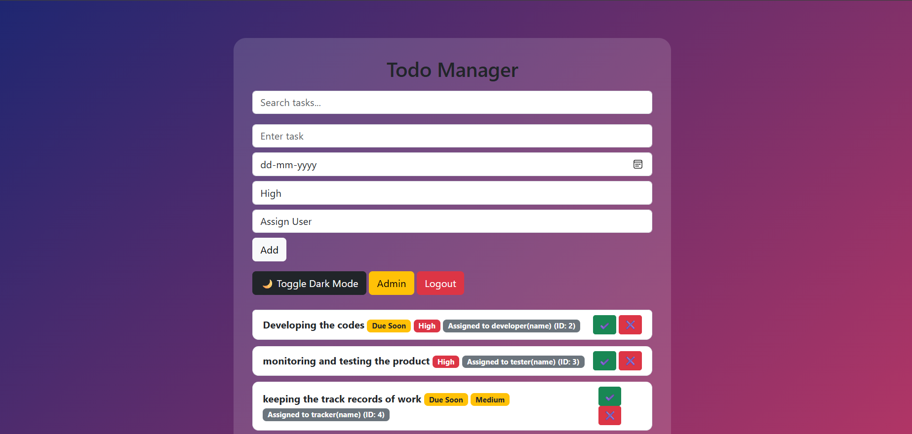
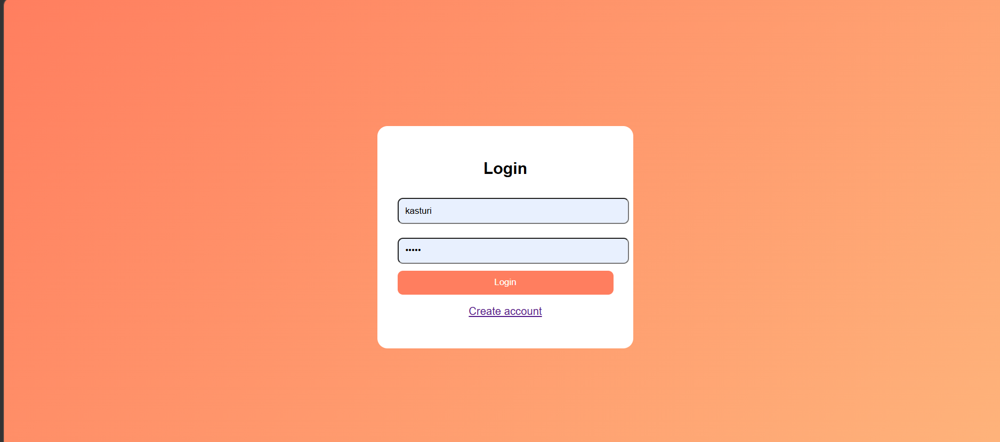
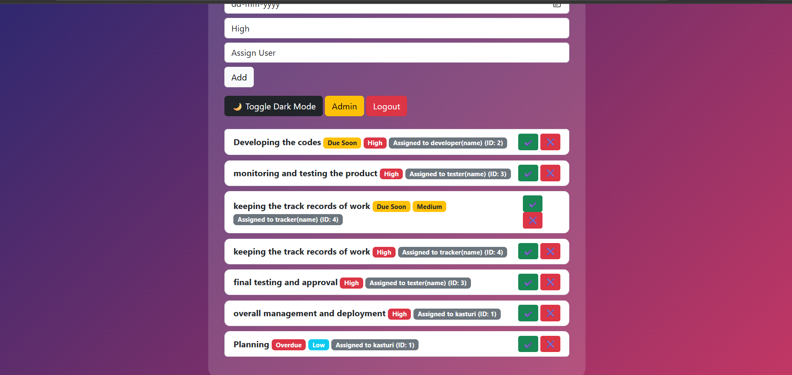
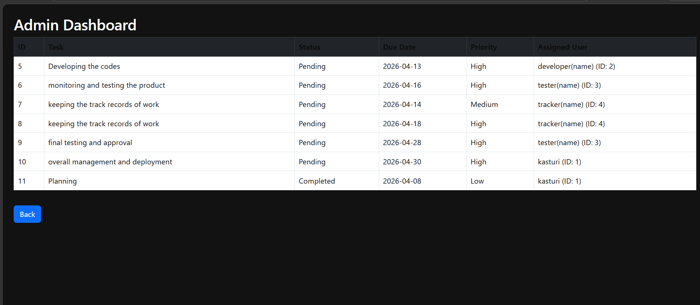
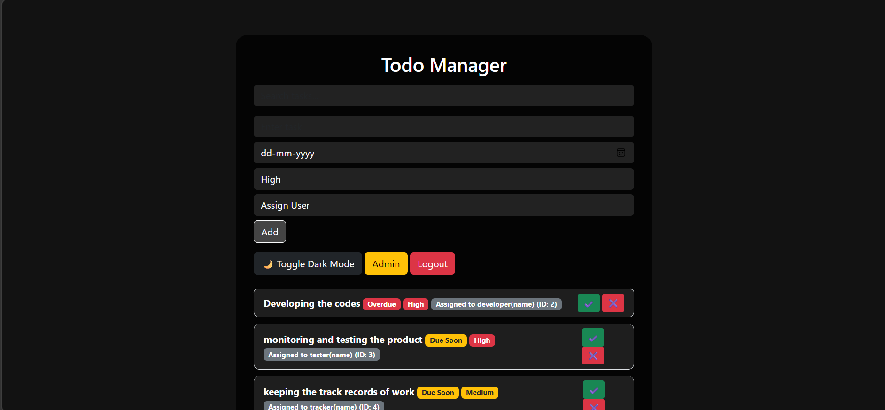
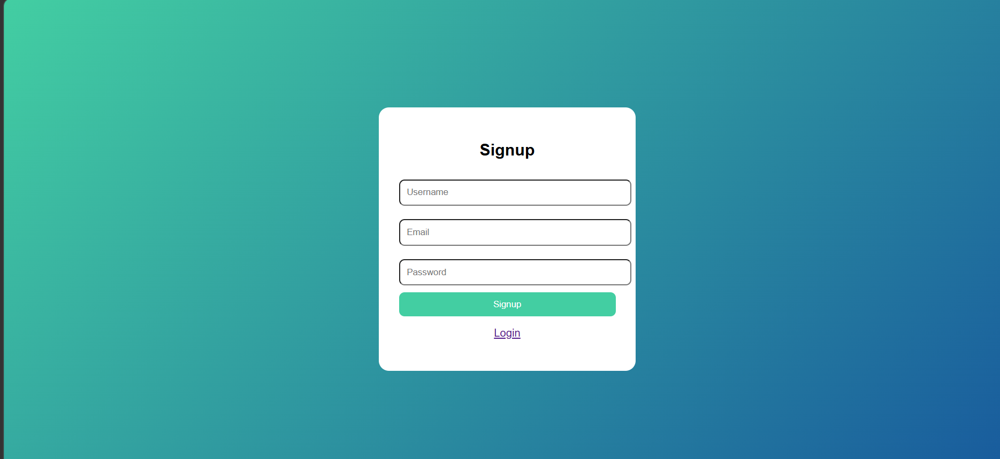

# 🚀 Smart Todo Manager with Team Collaboration & Notifications


\

---

## 📌 Overview

**Smart Todo Manager** is a full-stack web application built using **Flask (Python)** that helps users manage tasks efficiently with features like authentication, deadline tracking, email notifications, team collaboration, and an admin dashboard.

---

##

### ## 📸 Screenshots

### 🏠 Home Dashboard



### 🔐 Login Page



### 📝 Task Management



### 👑 Admin Dashboard



### 🌙 Dark Mode



### 🆕 Signup Page



---

## 🔥 Features

### 🔐 User Authentication

* Signup & Login system
* Password hashing using bcrypt
* Session management

### 📝 Task Management

* Add, update, delete tasks
* Mark tasks as completed/pending

### 🎯 Priority System

* High 🔴 | Medium 🟡 | Low 🔵

### 📅 Deadline Tracking

* Overdue alerts
* Due Soon notifications

### 🔔 Email Notifications

* Sends reminders for upcoming deadlines

### ⚙️ Background Scheduler

* Automatically checks deadlines

### 👥 Team Collaboration

* Assign tasks to users
* Displays assigned user name + ID

### 👑 Admin Dashboard

* Tabular overview of all tasks
* Includes assigned users

### 🔍 Search Functionality

* Search tasks easily

### 🌙 Dark Mode

* Toggle UI theme
* Persistent using localStorage

---

## 🛠️ Tech Stack

* **Frontend:** HTML, CSS, Bootstrap
* **Backend:** Flask (Python)
* **Database:** SQLite
* **Libraries:** bcrypt, schedule

---

## 📂 Project Structure

```
todo-manager/
│
├── app.py
├── tasks.db
├── static/
│   └── style.css
│
├── templates/
│   ├── index.html
│   ├── login.html
│   ├── signup.html
│   ├── admin.html
│
├── images/
│   ├── home.png
│   ├── login.png
│   ├── tasks.png
│   ├── admin.png
│   ├── darkmode.png
│
└── README.md
```

---

## 🧪 How to Use

1. Signup/Login
2. Add tasks with deadline & priority
3. Assign tasks to users
4. Track status
5. View admin dashboard
6. Receive email notifications

---

## 🎯 Future Improvements

* Role-based authentication (Admin/User)
* Drag & drop interface (Trello-style)
* Real-time notifications
* Cloud deployment

---

## 🎤 Demo Description

> This project is a smart task management system with automation, collaboration, and analytics features, designed to simulate real-world productivity tools.

---

## 👩‍💻 Author

**Kasturi Raskar**

---

## ⭐ Support

If you like this project, consider giving it a ⭐ on GitHub!
